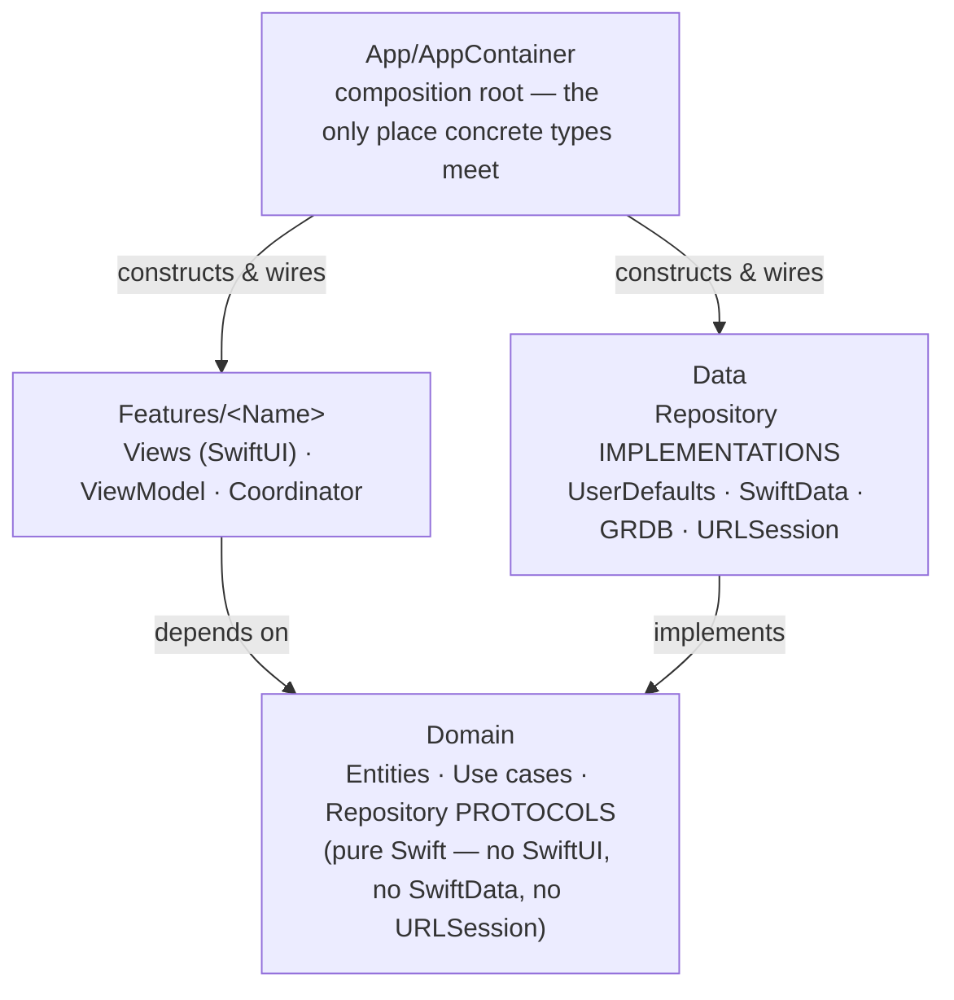
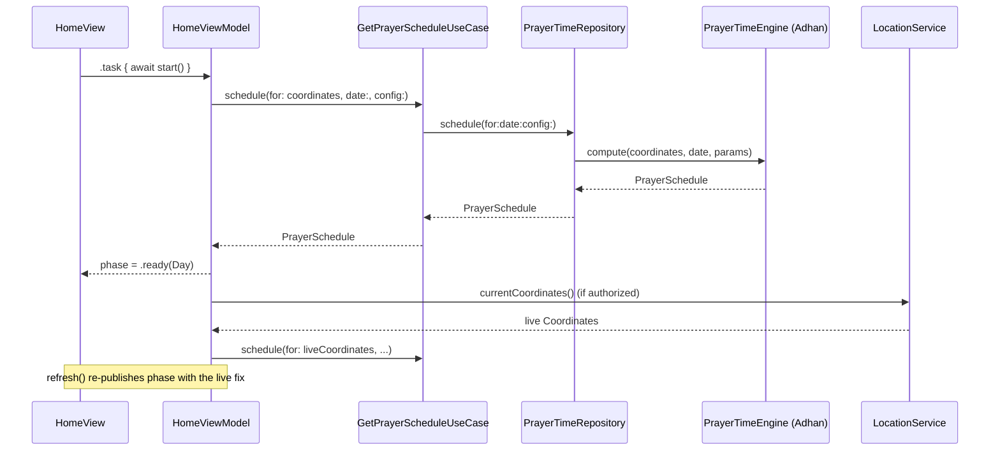

# Architecture

Noor is a Clean Architecture / MVVM-C app, in one SwiftUI codebase that ships
to iPhone, iPad, and macOS. This document is the map of *why* it is shaped
this way — for the folder-by-folder rules an editor should follow while
writing code in it, see [`CLAUDE.md`](CLAUDE.md), which this file assumes as
background rather than repeats.

## Layers, and the rule between them



**Features depend on Domain. Data implements Domain. Neither depends on the
other.** A view model asks a repository *protocol* for a `PrayerSchedule` or
a list of adhkar; it has no idea whether the answer came from Adhan's
astronomy, a SwiftData query, or a GRDB read against a bundled SQLite file.
That swap happens once, in `AppContainer` — the composition root — which is
the only file in the app allowed to write `UserNotificationCenterClient()` or
`PrayerTimeEngine()` by name.

This buys two things a typical MVVM app doesn't get for free:

- **Every use case is unit-testable without a simulator.** Domain has no
  SwiftUI, UIKit, SwiftData, or URLSession import, so a `GetPrayerScheduleUseCase`
  test hands it a fake repository and asserts on plain Swift values.
- **The storage technology is swappable in one place.** `PersistenceController`
  is the only file that knows the mutable-data store is SwiftData; `CorpusDatabase`
  is the only file that knows the reference content is GRDB over SQLite. Neither
  fact leaks past its own `Data/` folder.

## Repeating shape: `Core/<Subsystem>`

Every cross-cutting subsystem under `Core/` repeats the same three-way split,
one level down:

```
Core/<Subsystem>/
  Domain/   protocols + entities — pure Swift, no SwiftUI / SwiftData / URLSession
  Data/     implementations — UserDefaults, SwiftData, URLSession, GRDB, CoreLocation…
  UI/       SwiftUI glue — @Observable @MainActor managers, @Entry environment values
```

`Core/Location`, `Core/Notifications`, `Core/Theming`, `Core/Localization`,
`Core/Settings`, `Core/PrayerTimes`, `Core/Persistence` all follow it. Knowing
the pattern once means knowing where to look in any of them: the protocol is
always in `Domain`, the framework import is always in `Data`.

## Folder map

```
ThawabForGod/
├── App/            Composition root: AppContainer (manual DI), app entry, routing
├── Core/           Cross-cutting infra — one Domain/Data/UI split per subsystem
│   ├── PrayerTimes/    Adhan-backed engine — also the Qibla bearing's source
│   ├── Location/       CoreLocation behind a one-shot, permission-aware protocol
│   ├── Notifications/  Rolling reminder window + BGTaskScheduler background refill
│   ├── Persistence/    SwiftData (mutable) + Corpus/ (read-only GRDB over SQLite)
│   ├── Theming/        Accent + appearance, no view ever branches on colorScheme
│   ├── Localization/   AR/EN strings, digit system, clock format
│   ├── Settings/       The one key/value store every preference writes through
│   ├── Networking/     Optional by design — no core feature may require it
│   └── Tips/           TipKit configuration
├── Features/       One folder per feature: Views + ViewModel + Coordinator
│   ├── Home/           Prayer times + next-prayer countdown
│   ├── Onboarding/     First-run: permissions, calculation method
│   ├── Qibla/          Compass + distance, reusing the prayer-time engine
│   ├── Adhkar/         Morning/evening remembrance, the first corpus reader
│   ├── Tasbih/         Electronic counter — corpus phrases, SwiftData counts
│   ├── NamesOfAllah/   The 99 names, read-only, in-memory search
│   └── Settings/       Drives every preference above; stores none of its own
└── Resources/      Assets, Localizable.xcstrings, bundled corpus.sqlite
```

## Data flow: a screen appearing

Home's launch path is representative of how every feature is wired — nothing
in a `View` ever constructs a concrete type:



The seeded (onboarding, or Makkah) coordinates draw the first frame
immediately; a live fix, once `LocationService` can produce one, silently
replaces it without the screen ever sitting on a loading state waiting for
GPS.

## Concurrency

`SWIFT_DEFAULT_ACTOR_ISOLATION = MainActor` — every declaration in the module
is implicitly main-actor-isolated unless marked `nonisolated`. That is a
deliberate default for a UI-heavy app, but it means background work (a GRDB
read, a `URLSession` call, a `@ModelActor`) needs *deliberate* isolation
reasoning, not a reflexive `@MainActor` on everything. A few load-bearing
examples:

- `CorpusDatabase` reads land off the main actor for free — GRDB dispatches
  the body of `read` onto the database's own queue, whatever actor asked.
- `TasbihProgressRepository` is a `@ModelActor`, so SwiftData writes happen on
  their own actor even though the view model calling it is `@MainActor`.
- `ReachabilityMonitor` and `UserNotificationService` are `@MainActor`
  explicitly, documenting that they are UI-facing rather than relying on the
  module default to make that true.

The language mode is still Swift 5 (`SWIFT_VERSION = 5.0`), but new code is
written as if strict concurrency were already on — explicit isolation,
`Sendable` at the boundaries — so flipping the switch later is a non-event.
`xcodebuild … SWIFT_VERSION=6.0` (see the README) is how that gets checked
without touching the project's real setting.

## Testing

Two frameworks, deliberately: unit tests use **Swift Testing**
(`ThawabForGodTests`), UI tests stay on **XCTest** (`ThawabForGodUITests`).
Domain use cases, services, and view models get unit tests against fakes;
nothing in `Domain` needs a simulator to test. See the root README for the
exact `xcodebuild` invocations.

## Further reading

- [`CLAUDE.md`](CLAUDE.md) — the living, folder-by-folder set of conventions
  this file summarizes the shape of. Read it before writing code, not just
  this document.
- [`ThawabForGod/Resources/Corpus/README.md`](ThawabForGod/Resources/Corpus/README.md) —
  how the bundled reference content (adhkar, 99 names) was sourced,
  cross-checked, and what is still unverified.
- [`Islamic_App_Architecture_Plan.md`](Islamic_App_Architecture_Plan.md) — the
  original product and phasing plan this app is being built against.
